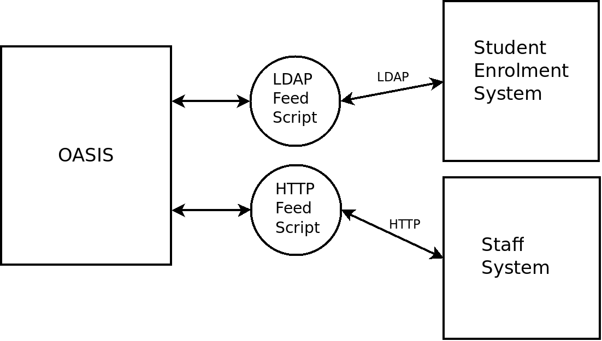

..

External Systems
================

To obtain information from other systems OASIS uses "feeds". These are
small scripts which, when run, will communicate with other systems. For
example, one might connect to a central LDAP server and retrieve enrolment
information.

.. sidebar:: License Aside

  One of the reasons for implementing external feeds as small scripts with
  a defined interface is that they are not bound by the AGPL license
  that OASIS comes under, and do not have to be written in Python.
  This allows you to link OASIS to non open-source systems.

Working examples are included to cover several common cases,
but you can add your own. If you name them local_SOMETHING,
they will not be accidentally overwritten by future OASIS upgrades.

You can have different feeds connecting to different systems if you wish.
There are currently two supported types of feed:

Group Feeds
^^^^^^^^^^^

Group Feed scripts tell OASIS how users are arranged into groups. For example: students
enrolled in courses, or groups of tutors.

When run, the feed scripts should output a one line status code followed by a simple list of usernames, one per line::

  OK
  ccog001
  fsmi324
  jblo034

If the feed encounters an error, it should output a one line ERROR code, followed
by a human readable error message, for example::

  ERROR FATAL
  This feed script was unable to contact
  the LDAP server, please see the server
  log for details.

OASIS will report these errors (if any) in the Server Administration feeds pages of the
application.

The following status codes are meaningful to OASIS:

OK
  The feed worked and the output can be used.

ERROR TEMPORARY
  The error is temporary, OASIS can try again later.

ERROR FATAL
  The error is serious, OASIS should deactivate the feed and not try it again
  until the systems administrator has investigated (and can manually reactivate
  the feed when it is fixed)

Look at the files in the OASIS `deploy/feeds <https://github.com/colincoghill/oasisqe/tree/master/deploy/feeds>`_ folder for some example scripts.

User Account Feeds
^^^^^^^^^^^^^^^^^^

User Account feeds tell OASIS how to find details on users with non-OASIS accounts.

For example when "fjon032" logs in for the first time, OASIS may run the User
Account Feed scripts and expect one of them to return the user's full name,
email address, and an optional ID. (The ID could be a student ID number or similar)::

  ./user_feed_lookup fjon032
  OK
  fjon032,Freddie Jones,f.jones@example.com

  ./user_feed_lookup sdoo1
  OK
  sdoo1,Scooby Doo,s.doo@example.com,S10293754

It may periodically re-run these to pick up any changes to the user's details.

The User Account Feed scripts can accept multiple usernames at a time. This allows
them to be more efficient when, for example, retrieving information on a new large
class with 500 students::

  ./script_fetch_students fjon032 dbla377 nrogers
  OK
  fjon032,Freddie Jones,f.jones@example.com
  dbla377,NOTFOUND
  nrogers,Norville Rogers,shaggy@example.com

In this example, the feed script could not find information about "dbla377"

If there is an error, it should output a one line status code, followed
by a human readable error message, for example::

  ./script_fetch_students fjon032 dbla377 nrogers
  ERROR TEMPORARY
  Enrolment database is locked, please try later.

The status codes are the same as for Group Feeds.

No Feeds
^^^^^^^^

It is entirely possible to run OASIS as a standalone system, without configuring any feeds. It
will look after its own user accounts and groups. However, feeds allow you to integrate OASIS
with other systems which may already look after accounts and groups for you.

