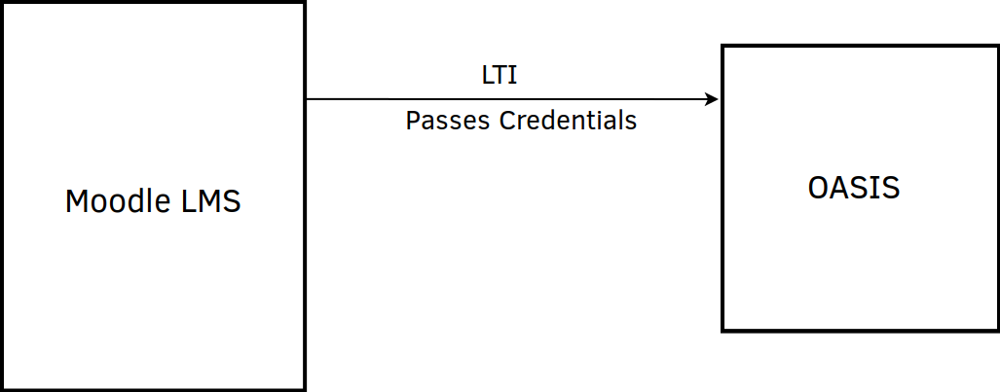

..

Learning Tools Interoperability (LTI)
=====================================

see. [ http://www.imsglobal.org/activity/learning-tools-interoperability ]

OASIS implements a small subset of LTI to allow it to be used for "single sign-on" from other Learning Management Systems (LMS)
such as Moodle or Sakai.

This allows students to click a link in, for example, Moodle, and move seamlessly to an OASIS Practice Topic without having
to re-authenticate or re-login.

OASIS does not yet implement embedding of content or returning of grades.

To configure LTI, the two systems need to be configured to communicate with each other. In LTI terms,
OASIS takes the role of "LTI Provider" and the other system takes the role of "LTI Consumer".

The consumer LMS (eg. Moodle or Sakai) need to be told the URL to use to talk to OASIS, a
`consumer_key` which they use to identify themselves, and a `shared_secret`, which the two
systems use to authenticate each other and keep things secure.

Below is an example for the Moodle LMS, but any system that supports connecting to LTI Providers should be similar.

Configuration Example
^^^^^^^^^^^^^^^^^^^^^

Moodle [ https://moodle.com/ ] is a popular Open Source Learning Management System. It supports linking to other systems 
via its `External Tool` feature.

Notes
-----

Require
-------
  * *Consumer Key* Something that will identify the LMS. "moodle.mysite.com" or a name. Not secret, will be displayed in OASIS.
  * *Shared Secret* Confidential. The two systems need to know this but should keep it safe, you will not need to type it often, so make it secure and impossible to guess. eg.  "Mighal6Oongaece7oiwei3CholaeweiW"
   You can change this later, as long as you change it in both systems.

Moodle
------
  * System - add External Tool
  * Course - use External Tool to link to OASIS menu "/oasis/lti/main"
  * Course - use External Tool to link to OASIS practice topic "/oasis/lti/practice/subcategory/193"
  * Course - use External Tool to link to OASIS assessment "/oasis/lti/assess/startexam/4/143"

OASIS
-----
  * System - add LTI Consumer. Make sure you check "Active"
  * Notes - Access control, User Accounts

