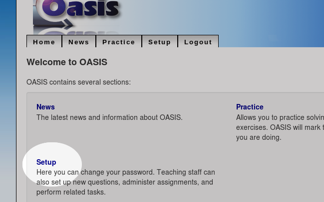
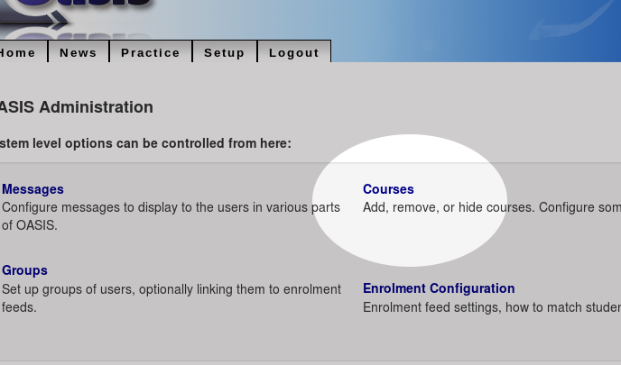

..

Course Administration
=====================

A Course in OASIS is a collection of *content* - questions and assessments,
and groups of *people* - students and staff.

Creating a Course
-----------------

To start with, we'll create a simple course that users can enrol themselves into. This
doesn't require setting up integration with external systems, so is a good place to start.

#. As the administrator user, log in to OASIS and from the main menu select the **Setup** page.

#. From here you can go to the main administation area by following the **Server Admin** link:

.. image:: snap_setup_serveradmin.png
   :width: 600px

#. To add a new course to the system, first choose the **Courses** option:

#. And choose the *Add Course* button:

