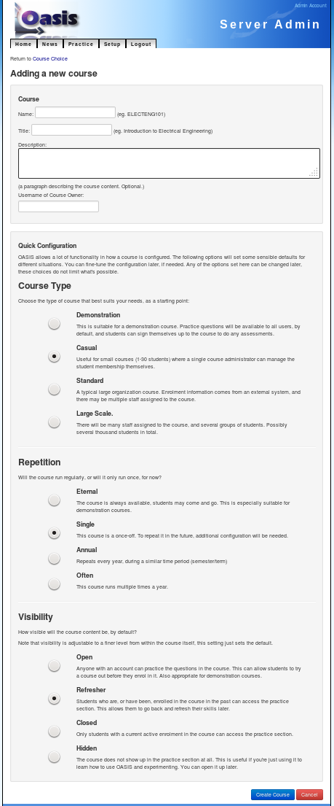

..

Course Administration
=====================

A Course in OASIS is a collection of *content* - questions and assessments,
and groups of *people* - students and staff.

Course Configuration
--------------------

Names
^^^^^
A course has a *name* and a *title*, for example "PHYSICS101" and "Introduction
to Physics". The name must be unique.

Members
^^^^^^^
A course will contain one or more *groups*. A *group* is a collection of users -
staff or students. By default, anyone in one of the groups can access the
content in the course - practice questions and assessments.

Groups
^^^^^^
Membership in groups can be controlled in different ways. There are three main
types of group:

.. sidebar:: Example Groups

    "PHYSICS101" might contain four groups of members, who will have access at different times.

        * Physics Students, Term 1, 2013
             Membership controlled by central LDAP server
        * Physics Students, Term 2, 2013
             Membership controlled by central LDAP server
        * Physics Tutors, Full Year, 2013
             Membership managed by Course Coordinator in OASIS
        * Physics Staff, Any Time
             Membership controlled by Course Coordinator in OASIS

*adhoc*: The course coordinator can add or remove users from the group from the
course administration area in OASIS. This is a good way to manage small courses,
or content that is not related to an "official" course.

*open*: An open group will allow users to add themselves to the group. If you
have one or more open groups in your course, then any user can give themselves
access to your course. This is ideal for demonstration or voluntary content.

*feed*: The group membership is controlled external to OASIS - perhaps from
a central university enrolment system. This will have to be configured by
the OASIS systems administrator, but once it is, course administrators can
make use of these groups.

Groups exist for specific a time *period*. For example "Term 1, 2014". These
can be set up by the systems administrator.

Adding a Course
---------------

To start with, we'll create a simple course that users can enrol themselves into. This
doesn't require setting up integration with external systems, so is a good place to start.

As the administrator user, log in to OASIS and from the main menu select the **Setup** page.

    .. image:: snap2_login_admin.png
       :width: 200px

    .. image:: snap2_main_menu_setup_hl.png
       :width: 400px

From here you can go to the course administration area by following the **Course Admin** link:

    .. image:: snap2_setup_menu_cadmin_hl.png
       :width: 400px

To add a new course to the system, choose the *Add Course* button:

    .. image:: snap2_cadmin_blank_addc_hl.png
       :width: 400px

You should be presented with a form where you can provide information about
the new course.

.. sidebar:: Course Details

    **Name**: is a short name for the course. Most universities use a code such as
    ELECTENG101 or PHYSICS130. If OASIS is being used with real courses, use that as
    the name.

    **Title**: is a longer name for the course. Generally a more descriptive name
    such as "Introduction to Physics".

    **Description**: This is optional, but will be displayed alongside the course
    name/title to give users more information. A paragraph describing the course
    content would be appropriate here.

    **Course Owner**: One person will be delegated full control over this course
    in OASIS. It defaults to the admin user, but you can fill in the username of
    another person who you wish to delegate responsibility for the course.

Quick Configuration
^^^^^^^^^^^^^^^^^^^

