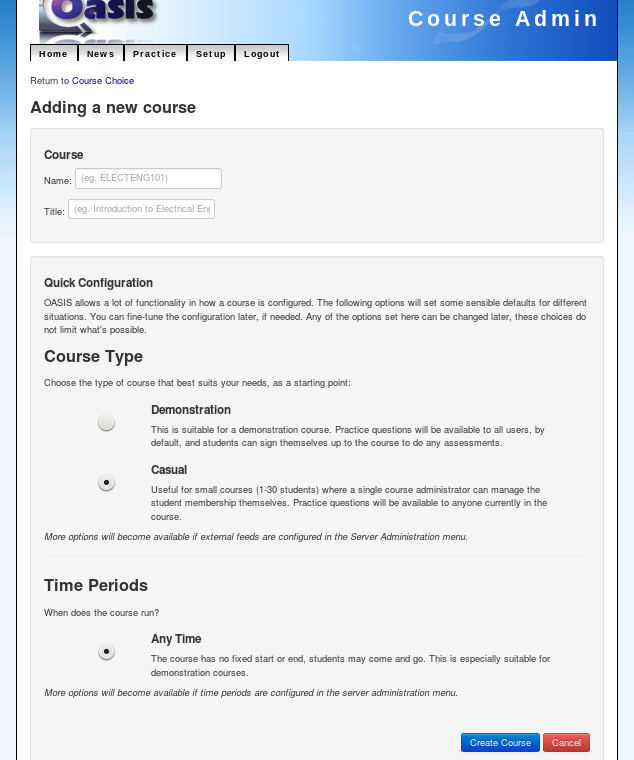

..

Course Administration
=====================

A Course in OASIS is a collection of *content* - questions and assessments,
and groups of *people* - students and staff.

Adding a Course
---------------

To start with, we'll create a simple course that users can enrol themselves into. This
doesn't require setting up integration with external systems, so is a good place to start.

As the administrator user, log in to OASIS and from the main menu select the **Setup** page.

    .. image:: snap2_login_admin.png
       :width: 200px

    .. image:: snap2_main_menu_setup_hl.png
       :width: 400px

From here you can go to the course administration area by following the **Course Admin** link:

    .. image:: snap2_setup_menu_cadmin_hl.png
       :width: 400px

To add a new course to the system, choose the *Add Course* button:

    .. image:: snap2_cadmin_blank_addc_hl.png
       :width: 400px

You should be presented with a form where you can provide information about
the new course.

.. sidebar:: Course Details

    **Name**: is a short name for the course. Most universities use a code such as
    ELECTENG101 or PHYSICS130. If OASIS is being used with real courses, use that as
    the name.

    **Title**: is a longer name for the course. Generally a more descriptive name
    such as "Introduction to Physics".

    **Description**: This is optional, but will be displayed alongside the course
    name/title to give users more information. A paragraph describing the course
    content would be appropriate here.

    **Course Owner**: One person will be delegated full control over this course
    in OASIS. It defaults to the admin user, but you can fill in the username of
    another person who you wish to delegate responsibility for the course.

Quick Configuration
^^^^^^^^^^^^^^^^^^^

