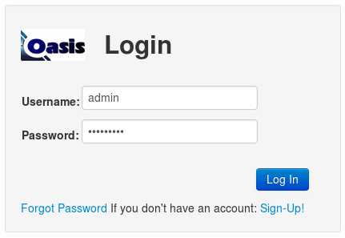
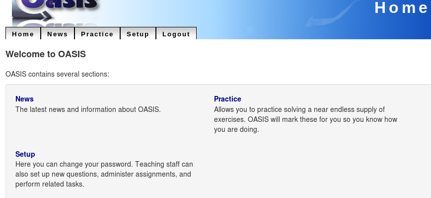

.. OASIS QE documentation master file, created by

"Small" Installation
====================

This section will walk through the installation of an example small OASIS setup.

In this case, we are installing OASIS standalone on a single server, to run a
hobbyist study site. It does not integrate with external systems, and users
can sign themselves up and decide which content they wish to access. The whole
site is run by a single person, in their spare time.

Need to know
^^^^^^^^^^^^
  * The URL the site will run on
  * The e-mail address of the person running/supporting OASIS

In this case we'll use:
  http://www.oasisqe.com/hobbies
and email:
  hobbies@oasisqe.com

Install and Configure
^^^^^^^^^^^^^^^^^^^^^

Install OASIS according to :doc:`installation`

The OASIS configuration file should already default mostly to running in this
mode, but you will need to change some things::

   nano /etc/oasisqe.ini

First, the web interface. We need to tell OASIS our URL::

   [web]
   url: https://www.oasisqe.com/hobbies
   statichost: https://www.oasisqe.com
   staticpath: hobbies

And the contact e-mail address to display on the web interface::

   email: hobbies@oasisqe.com

Allow anyone to sign up and create an account::

   open_registration: True

Information about the application comes next::

   [app]

   homedir: /opt/oasisqe/3.9/src
   logfile: /var/log/oasisqe/main.log

The *secretkey* is an important security measure. It protects users from being
able to log in as each other, among other things. We must change it to something
random and secret (use your own)::

   secretkey: t9Yptn0YjnSSmRafe0KF5F8Cyz3bUw

Since there's just one administrator, when the system generates serious errors,
the email address to send them to will be the same as above::

   email_admins: hobbies@oasisqe.com

Normally such a site will have been configured to send its own mail previously,
but if we had an external mail server we could configure it here::

   smtp_server: localhost

We don't need external "feeds" for a site that manages its own accounts::

   #  location for scripts that handle feeds (eg. enrolment)
   # feed_path:

The database configuration will already have been handled during the install
process::

   [db]

   host: localhost
   dbname: oasisdb
   uname: oasisdb
   pass: SECRET
   port: 5432

As will the cache settings::

   [cache]

   cachedir: /var/cache/oasisqe/v3.9
   memcache_enable: True

A low-usage site won't need memcached, so we could set memcache_enable: to False if we wanted. However,
it's easy enough to install and does make OASIS respond significantly faster in many
situations.

Any time we make changes to this configuration file, we must tell Apache
to restart OASIS::

  service apache2 restart

Now we can log in to OASIS and verify that it all works:

We open a web browser and go to the URL: https://www.oasisqe.com/hobbies
(obviously, using our own URL here)

And we should see the main menu:

Create a Course
^^^^^^^^^^^^^^^

