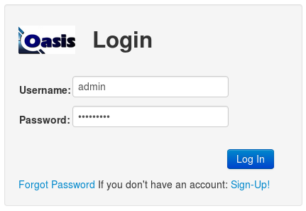
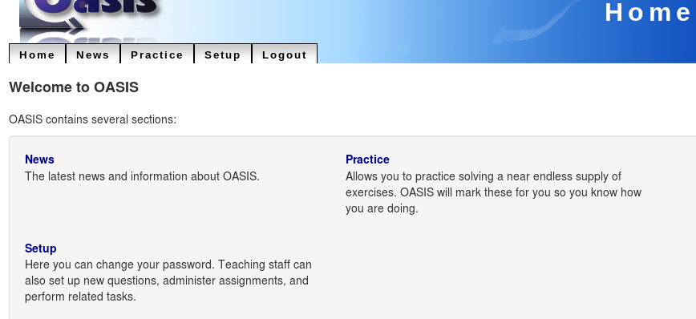

.. OASIS QE documentation master file, created by

"UofA" Installation
====================

This section will walk through the installation of OASIS at an un-named university.

Need to know
^^^^^^^^^^^^
  * The URL the site will run on
  * The e-mail address of the person providing desktop support for OASIS
  * The e-mail address of the systems administrator responsible for OASIS
  * The address of an SMTP server OASIS can use to send email
  * How to link our web server to the existing university systems for authentication.
  * How to retrieve account details and enrolment information from the university systems.

In this case for the site we'll use the URL:
  http://www.oasisqe.com/uofa
and email:
  uofa@oasisqe.com
our local SMTP server is at:  smtp.oasisqe.com

In this example our external system makes enrolment and authentication
information available via an LDAP server.

Install and Configure
^^^^^^^^^^^^^^^^^^^^^

Install the OASIS database server according to :doc:`installation_external_db`

On the web application server we will need to change some things in the OASIS configuration file::

   nano /etc/oasisqe.ini

First, the web interface. We need to tell OASIS our URL::

   [web]
   url: https://www.oasisqe.com/medium
   statichost: https://www.oasisqe.com
   staticpath: hobbies

And the contact e-mail address to display on the web interface::

   email: medium@oasisqe.com

Don't allow anyone to sign up and create an account::

   open_registration: False

Information about the application comes next::

   [app]

   homedir: /opt/oasisqe/3.9/src
   logfile: /var/log/oasisqe/main.log

The *secretkey* is an important security measure. It protects users from being
able to log in as each other, among other things. We must change it to something
random and secret (use your own)::

   secretkey: t9Yptn0YjnSSmRafe0KF5F8Cyz3bUw

Since there's just one administrator, when the system generates serious errors,
the email address to send them to will be the same as above::

   email_admins: medium@oasisqe.com

Tell OASIS to send email via the organization's mail server::

   smtp_server: mail.oasisqe.com

We need to use external "feeds" to link to the enrolment system::

   #  location for scripts that handle feeds (eg. enrolment)
   feed_path: /var/lib/oasisqe/feeds

The database configuration values come will already have been handled during the install
process::

   [db]

   host: localhost
   dbname: oasisdb
   uname: oasisdb
   pass: SECRET
   port: 5432

As will the cache settings::

   [cache]

   cachedir: /var/cache/oasisqe/v3.9
   memcache_enable: True

Any time we make changes to this configuration file, we must tell Apache
to restart OASIS::

  service apache2 restart

Now we can log in to OASIS and verify that it all works:

We open a web browser and go to the URL: https://www.oasisqe.com/medium
(obviously, using our own URL here)

And we should see the main menu:

Create a Course
^^^^^^^^^^^^^^^

